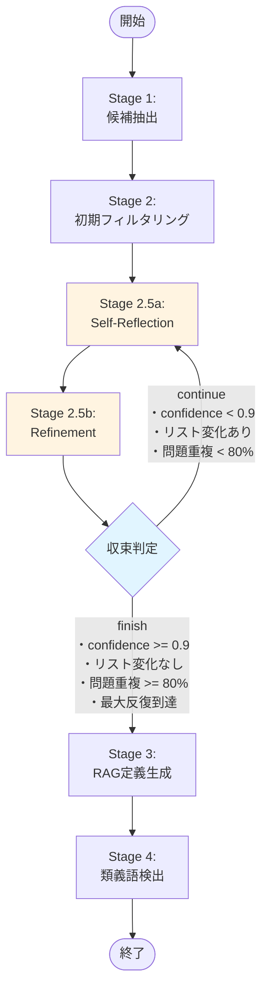
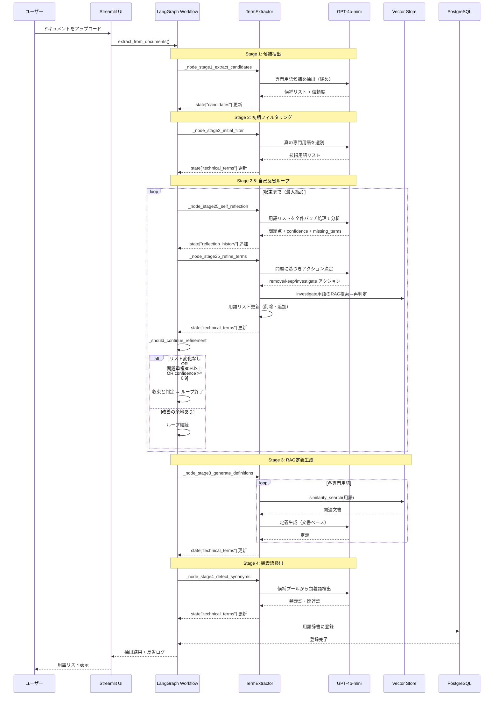
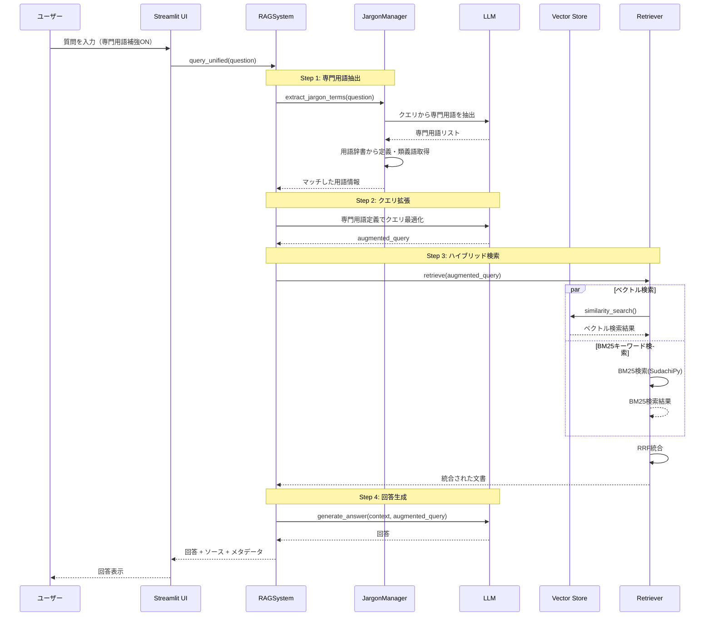
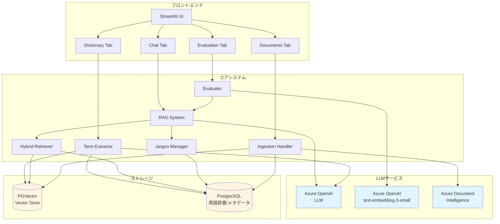

# Advanced RAG System with LLM-based Term Extraction

## 概要

LLMベースの専門用語抽出による辞書機能を実装したRAGA

### 🌟 主要な特徴

- **LLMベース専門用語抽出**: LLMを使用した4ステージの用語抽出プロセス
- **ハイブリッド検索**: PGVectorベクトル検索とBM25キーワード検索（SudachiPy形態素解析）
- **専門用語クエリ拡張**:専門用語辞書によりクエリを拡張
- **RAG定義生成**: LLMによる用語定義の自動生成
- **類義語自動検出**: 候補プールから関連語を検出

## 📚 専門用語抽出フロー（LangGraph実装）

**LangGraphによるワークフロー型抽出** - 各ステージをノードとして実装し、State管理で柔軟な制御を実現

### Stage 1: 候補抽出（緩めに）
- LLMが文書から専門用語候補を広く抽出
- 定義は不要、用語名のみを収集
- 並列処理でチャンクごとに候補を抽出

### Stage 2: 技術用語フィルタリング
- 候補から真の専門用語のみを選別
- 一般的すぎる語（「システム」「処理」など）を除外
- 除外された語も類義語候補として保持👈専門用語ではない類義語を拾うため

### Stage 2.5: 自己反省ループ（再帰的精緻化）⭐NEW
**LangGraphの条件分岐を活用した品質管理ループ**

- **2.5a Self-Reflection**: LLMが抽出結果を分析
  - 誤検出（一般語の混入）をチェック
  - 定義の妥当性を評価
  - 見落とし（候補に残された有用語）を検出
  - `confidence`, `should_continue` で収束判定

- **2.5b Refinement**: 反省に基づき用語リストを改善
  - `remove`: 一般語を即座に除外
  - `keep`: 専門用語として保持
  - `investigate`: RAG検索で定義を再生成 → 増分Stage2フィルタで再判定

- **ループ制御**: 収束条件で自動終了
  - 信頼度 >= 0.9
  - 用語リストに変化なし（ハッシュ比較）
  - 問題指摘が80%以上重複
  - 最大反復回数到達（デフォルト3回）

### Stage 3: RAGベース定義生成
- 専門用語に対してベクトルストアから関連文書を検索
- LLMが検索結果を基に定義を生成

### Stage 4: 類義語検出
- 候補プール全体から類義語・関連語を検出
- LLMの一般知識は使用せず、文書内の語句のみ
- 専門用語と一般表現の関連付け（例：「機械学習」と「学習」）

### LangGraph ワークフローフロー図



### シーケンス図



## 🔍 主な機能

### 検索・取得
- **ハイブリッド検索**: ベクトル検索とBM25キーワード検索をReciprocal Rank Fusion (RRF)で統合
- **PGVector**: PostgreSQL + pgvectorによる高速ベクトル検索
- **BM25キーワード検索**: SudachiPy形態素解析によるインメモリBM25検索（日本語対応）
- **専門用語クエリ拡張**: 定義・類義語・関連語を活用した検索最適化

### 専門用語処理
- **LLMベース抽出**: 統計手法不要のシンプルな実装
- **4段階処理**: 候補抽出 → フィルタリング → 定義生成 → 類義語検出
- **RAG定義生成**: ベクトル検索 + LLMによる高品質な定義
- **類義語検出**: 文書内の語句のみを使用（LLMの一般知識を排除）

### RAGクエリフローのシーケンス図



### システムアーキテクチャ図



## システム構成

```
.
├── app.py                      # Streamlitアプリケーションのエントリポイント
├── requirements.txt            # Pythonライブラリ依存関係
├── .env.example                # 環境変数の設定テンプレート
├── src/
│   ├── core/
│   │   └── rag_system.py       # RAGシステムのメインロジック
│   ├── rag/                    # RAG関連モジュール
│   │   ├── config.py           # 設定管理
│   │   ├── prompts.py          # LLMプロンプトテンプレート
│   │   ├── term_extraction.py  # 専門用語抽出（4ステージ）
│   │   ├── retriever.py        # ハイブリッド検索リトリーバー
│   │   ├── reverse_lookup.py   # 逆引き検索
│   │   ├── ingestion.py        # ドキュメント取り込み処理
│   │   ├── evaluator.py        # 評価システム
│   │   ├── text_processor.py   # テキスト処理
│   │   ├── sql_handler.py      # ドキュメントチャンク取得用SQLハンドラー
│   │   └── pdf_processors/     # PDF処理モジュール
│   ├── ui/                     # Streamlit UIモジュール
│   │   ├── chat_tab.py         # チャットインターフェース
│   │   ├── dictionary_tab.py   # 用語辞書タブ
│   │   ├── documents_tab.py    # ドキュメント管理タブ
│   │   ├── evaluation_tab.py   # 評価結果表示タブ
│   │   └── settings_tab.py     # 設定タブ
│   └── utils/                  # ユーティリティ
│       ├── helpers.py          # ヘルパー関数（cosine_similarityなど）
│       ├── profiler.py         # パフォーマンス計測
│       └── style.py            # UIスタイル
├── scripts/
│   ├── extract_terms.py        # 専門用語抽出CLI
│   ├── fix_document_type.py    # メタデータtype修復スクリプト
│   └── test_bm25_search.py     # BM25・ハイブリッド検索テスト
├── data/                       # データファイル
├── docs/                       # ドキュメント
└── output/                     # 出力ファイル
```

## セットアップ

### 1. 仮想環境の作成

```bash
python -m venv myenv
myenv\Scripts\activate  # Windows
```

### 2. 依存関係のインストール

```bash
pip install -r requirements.txt
```

### 3. PostgreSQLとpgvectorのセットアップ👈aws上のposgre利用しているため実行不要(なはず)

```sql
-- pgvector拡張機能を有効化
CREATE EXTENSION IF NOT EXISTS vector;

-- 専門用語辞書テーブル
CREATE TABLE IF NOT EXISTS jargon_dictionary (
    id SERIAL PRIMARY KEY,
    term TEXT UNIQUE NOT NULL,
    definition TEXT,
    domain TEXT,
    aliases TEXT[],
    related_terms TEXT[],
    confidence_score FLOAT,
    created_at TIMESTAMP DEFAULT CURRENT_TIMESTAMP,
    updated_at TIMESTAMP DEFAULT CURRENT_TIMESTAMP
);

-- ベクトルストア用テーブルはLangChainが自動作成します
```

### データベーススキーマ

#### langchain_pg_embedding（ベクトルストア）

langchain-community 0.3.x 以降で必要なスキーマ：

| カラム | 型 | 説明 |
|--------|------|------|
| uuid | UUID | 主キー（新スキーマ） |
| id | VARCHAR | 旧主キー（nullable） |
| collection_id | UUID | コレクション識別子 |
| embedding | vector | 埋め込みベクトル |
| document | VARCHAR | ドキュメント本文 |
| cmetadata | JSONB | メタデータ |
| custom_id | VARCHAR | カスタムID |
| tokenized_content | TEXT | トークン化済みコンテンツ（レガシー、BM25移行済み） |

```sql
-- スキーマ確認
SELECT column_name, data_type, is_nullable
FROM information_schema.columns
WHERE table_name = 'langchain_pg_embedding'
ORDER BY ordinal_position;

-- 手動でスキーマ修復が必要な場合
ALTER TABLE langchain_pg_embedding ADD COLUMN IF NOT EXISTS custom_id VARCHAR;
ALTER TABLE langchain_pg_embedding ADD COLUMN IF NOT EXISTS uuid UUID;
-- 主キー変更（id → uuid）は _ensure_pgvector_schema() で自動実行
```

#### 自動スキーマ修復機能

`RAGSystem` 初期化時に `_ensure_pgvector_schema()` が自動実行され、以下を修復：

1. **カラム追加**: `custom_id`, `uuid` が存在しない場合は追加
2. **主キー変更**: `id` → `uuid` への移行（langchain-community 0.3.x対応）
3. **NOT NULL制約解除**: 旧 `id` カラムのNOT NULL制約を解除

これにより、異なる環境間でのスキーマ互換性問題を自動的に解決します。

### 4. 環境変数の設定

`.env`ファイル:

```env
# Database
DB_HOST=localhost
DB_PORT=5432
DB_NAME=postgres
DB_USER=postgres
DB_PASSWORD=your-password

# Azure OpenAI
AZURE_OPENAI_API_KEY=your-api-key
AZURE_OPENAI_ENDPOINT=https://your-resource.openai.azure.com
AZURE_OPENAI_CHAT_DEPLOYMENT_NAME=gpt-4o
AZURE_OPENAI_EMBEDDING_DEPLOYMENT_NAME=text-embedding-3-small

# Azure Document Intelligence
AZURE_DI_ENDPOINT=https://your-di-resource.cognitiveservices.azure.com/
AZURE_DI_API_KEY=your-di-api-key
```

### 5. アプリケーションの起動

```bash
streamlit run app.py
```

ブラウザで `http://localhost:8501` にアクセス

## 使い方

### 1. ドキュメントの登録

1. 「📁 Documents」タブを開く
2. PDFまたはテキストファイルをアップロード
3. 「インジェスト開始」ボタンをクリック

### 2. 専門用語の抽出

1. 「📖 Dictionary」タブを開く
2. アップロードしたドキュメントを選択
3. 「専門用語抽出を実行」ボタンをクリック
4. 4ステージの処理が実行され、用語辞書に登録されます

### 3. 質問応答

1. 「💬 Chat」タブを開く
2. 高度なRAG設定（オプション）:
   - クエリ拡張: 質問を自動拡張
   - RAG-Fusion: 複数クエリ + RRF
   - 専門用語で補強: 用語辞書を使用👈検証で使うのはこれ
   - LLMリランク: 検索結果の再ランキング
3. 質問を入力して送信

### 4. 評価👈検索精度の評価機能のみ

1. 「🎯 Evaluation」タブを開く
2. CSVファイルで評価データをアップロード
3. バルククエリを実行
4. Recall、Precision、MRRなどの指標を確認

## CLIツール

大量のドキュメントを処理する場合、UIよりCLIが効率的です。

### ドキュメントインジェスト

```bash
# PDFファイルを指定してインジェスト
python scripts/ingest_documents.py path/to/file.pdf

# ディレクトリ内のPDFを一括処理
python scripts/ingest_documents.py --dir path/to/pdf_dir

# コレクション名を指定
python scripts/ingest_documents.py --collection my_collection path/to/file.pdf
```

### 専門用語抽出

```bash
# 基本（DBのdocument_chunksテーブルから抽出）
python scripts/extract_terms.py --collection documents --output output/terms.json

# PDFから直接抽出
python scripts/extract_terms.py --input path/to/pdfs --output output/terms.json

# Stage 2.5（自己反省ループ）を無効化して高速化
python scripts/extract_terms.py --collection documents --output output/terms.json --no-stage25

# 最大反復回数を指定（デフォルト3回）
python scripts/extract_terms.py --collection documents --max-iterations 5

# ドメイン分類方法を指定（embedding or llm）
python scripts/extract_terms.py --collection documents --domain-method llm
```

### その他のユーティリティ

```bash
# メタデータtype修復（NULL → 'document'）
python scripts/fix_document_type.py

# BM25・ハイブリッド検索テスト
python scripts/test_bm25_search.py
```