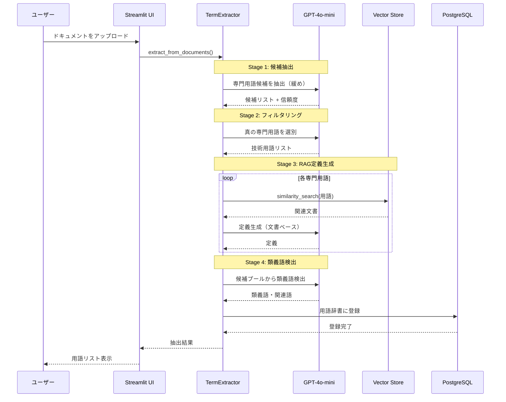
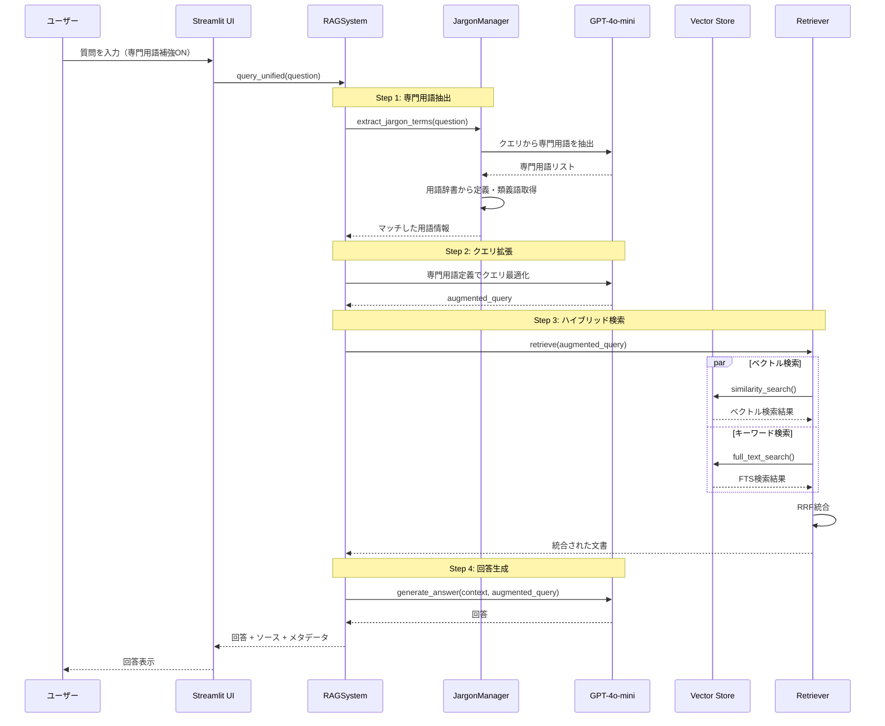

# Advanced RAG System with LLM-based Term Extraction

## 概要

LLMベースのシンプルな専門用語抽出を実装した次世代RAG（Retrieval-Augmented Generation）システムです。Azure OpenAI Serviceを活用し、Streamlitベースの直感的なUIで、日本語・英語の専門文書に対する強力な情報検索と質問応答を実現します。

### 🌟 主要な特徴

- **LLMベース専門用語抽出**: gpt-4o-miniを使用した4ステージの用語抽出プロセス
- **ハイブリッド検索**: PGVectorベクトル検索とPostgreSQL全文検索を組み合わせた高精度検索
- **専門用語クエリ拡張**: LLMを使用した検索クエリの最適化
- **RAG定義生成**: ベクトル検索とLLMによる高品質な用語定義の自動生成
- **類義語自動検出**: 候補プールから関連語を検出（文書内の語句のみ）
- **Azure統合**: Azure OpenAI ServiceとAzure Document Intelligenceによる高度なPDF処理
- **直感的UI**: Streamlitベースのタブ構成インターフェース

## 📚 専門用語抽出フロー

シンプルで効果的な4ステージ処理:

### Stage 1: 候補抽出（緩めに）
- LLMが文書から専門用語候補を広く抽出
- 定義は不要、用語名のみを収集
- 信頼度スコアを付与（0.0-1.0）

### Stage 2: 技術用語フィルタリング
- 候補から真の専門用語のみを選別
- 一般的すぎる語（「システム」「処理」など）を除外
- 除外された語も類義語候補として保持

### Stage 3: RAGベース定義生成
- 専門用語に対してベクトルストアから関連文書を検索
- LLMが検索結果を基に定義を生成
- 文書に基づいた正確で簡潔な定義

### Stage 4: 類義語検出
- 候補プール全体から類義語・関連語を検出
- LLMの一般知識は使用せず、文書内の語句のみ
- 専門用語と一般表現の関連付け（例：「機械学習」と「学習」）

### シーケンス図



## 🔍 主な機能

### 検索・取得
- **ハイブリッド検索**: ベクトル検索とキーワード検索をReciprocal Rank Fusion (RRF)で統合
- **PGVector**: PostgreSQL + pgvectorによる高速ベクトル検索
- **PostgreSQL FTS**: `to_tsvector()` + `ts_rank()` による全文検索（AWS RDS/Aurora対応）
- **専門用語クエリ拡張**: 定義・類義語・関連語を活用した検索最適化

### 専門用語処理
- **LLMベース抽出**: 統計手法不要のシンプルな実装
- **4ステージ処理**: 候補抽出 → フィルタリング → 定義生成 → 類義語検出
- **RAG定義生成**: ベクトル検索 + LLMによる高品質な定義
- **類義語検出**: 文書内の語句のみを使用（LLMの一般知識を排除）

### その他の機能
- **Text-to-SQL**: 自然言語クエリを自動的にSQLに変換
- **Azure Document Intelligence**: PDFの高精度処理とMarkdown出力
- **評価システム**: Recall、Precision、MRR、nDCG、Hit Rateなどの定量評価
- **用語辞書管理**: 抽出された専門用語の登録・検索・削除

### RAGクエリフローのシーケンス図



### システムアーキテクチャ図


## システム構成

```
.
├── app.py                      # Streamlitアプリケーションのエントリポイント
├── requirements.txt            # Pythonライブラリ依存関係
├── .env.example                # 環境変数の設定テンプレート
├── src/
│   ├── core/
│   │   └── rag_system.py       # RAGシステムのメインロジック
│   ├── rag/                    # RAG関連モジュール
│   │   ├── config.py           # 設定管理
│   │   ├── prompts.py          # LLMプロンプトテンプレート
│   │   ├── term_extraction.py  # 専門用語抽出（4ステージ）
│   │   ├── retriever.py        # ハイブリッド検索リトリーバー
│   │   ├── reverse_lookup.py   # 逆引き検索
│   │   ├── ingestion.py        # ドキュメント取り込み処理
│   │   ├── evaluator.py        # 評価システム
│   │   ├── text_processor.py   # テキスト処理
│   │   ├── sql_handler.py      # Text-to-SQL機能
│   │   └── pdf_processors/     # PDF処理モジュール
│   ├── ui/                     # Streamlit UIモジュール
│   │   ├── chat_tab.py         # チャットインターフェース
│   │   ├── dictionary_tab.py   # 用語辞書タブ
│   │   ├── documents_tab.py    # ドキュメント管理タブ
│   │   ├── evaluation_tab.py   # 評価結果表示タブ
│   │   └── settings_tab.py     # 設定タブ
│   └── utils/                  # ユーティリティ
│       ├── helpers.py          # ヘルパー関数（cosine_similarityなど）
│       ├── profiler.py         # パフォーマンス計測
│       └── style.py            # UIスタイル
├── data/                       # データファイル
├── docs/                       # ドキュメント
└── output/                     # 出力ファイル
```

## セットアップ

### 1. 前提条件

- Python 3.10以上
- PostgreSQL 15以上（pgvector拡張機能が必要）
- Azure OpenAI Service（gpt-4o-mini, text-embedding-3-small）
- Azure Document Intelligence（オプション：PDF処理用）

### 2. リポジトリのクローン

```bash
git clone <repository-url>
cd advancedrag_llm
```

### 3. 仮想環境の作成

```bash
python -m venv myenv
source myenv/bin/activate  # Linux/Mac
# または
myenv\Scripts\activate  # Windows
```

### 4. 依存関係のインストール

```bash
pip install -r requirements.txt
```

### 5. PostgreSQLとpgvectorのセットアップ

```sql
-- pgvector拡張機能を有効化
CREATE EXTENSION IF NOT EXISTS vector;

-- 専門用語辞書テーブル
CREATE TABLE IF NOT EXISTS jargon_dictionary (
    id SERIAL PRIMARY KEY,
    term TEXT UNIQUE NOT NULL,
    definition TEXT,
    domain TEXT,
    aliases TEXT[],
    related_terms TEXT[],
    confidence_score FLOAT,
    created_at TIMESTAMP DEFAULT CURRENT_TIMESTAMP,
    updated_at TIMESTAMP DEFAULT CURRENT_TIMESTAMP
);

-- ベクトルストア用テーブルはLangChainが自動作成します
```

### 6. 環境変数の設定

`.env.example`を`.env`にコピーして設定:

```bash
cp .env.example .env
```

`.env`ファイルを編集:

```env
# Database
DB_HOST=localhost
DB_PORT=5432
DB_NAME=postgres
DB_USER=postgres
DB_PASSWORD=your-password

# Azure OpenAI
AZURE_OPENAI_API_KEY=your-api-key
AZURE_OPENAI_ENDPOINT=https://your-resource.openai.azure.com
AZURE_OPENAI_CHAT_DEPLOYMENT_NAME=gpt-4o-mini
AZURE_OPENAI_EMBEDDING_DEPLOYMENT_NAME=text-embedding-3-small

# Azure Document Intelligence (Optional)
AZURE_DI_ENDPOINT=https://your-di-resource.cognitiveservices.azure.com/
AZURE_DI_API_KEY=your-di-api-key
```

### 7. アプリケーションの起動

```bash
streamlit run app.py
```

ブラウザで `http://localhost:8501` にアクセス

## 使い方

### 1. ドキュメントの登録

1. 「📁 Documents」タブを開く
2. PDFまたはテキストファイルをアップロード
3. 「インジェスト開始」ボタンをクリック

### 2. 専門用語の抽出

1. 「📖 Dictionary」タブを開く
2. アップロードしたドキュメントを選択
3. 「専門用語抽出を実行」ボタンをクリック
4. 4ステージの処理が実行され、用語辞書に登録されます

### 3. 質問応答

1. 「💬 Chat」タブを開く
2. 高度なRAG設定（オプション）:
   - クエリ拡張: 質問を自動拡張
   - RAG-Fusion: 複数クエリ + RRF
   - 専門用語で補強: 用語辞書を使用
   - LLMリランク: 検索結果の再ランキング
3. 質問を入力して送信

### 4. 評価

1. 「🎯 Evaluation」タブを開く
2. CSVファイルで評価データをアップロード
3. バルククエリを実行
4. Recall、Precision、MRRなどの指標を確認

## 技術スタック

- **フレームワーク**: Streamlit, LangChain
- **LLM**: Azure OpenAI (gpt-4o-mini)
- **Embeddings**: Azure OpenAI (text-embedding-3-small)
- **ベクトルDB**: PostgreSQL + pgvector
- **PDF処理**: Azure Document Intelligence
- **言語**: Python 3.10+